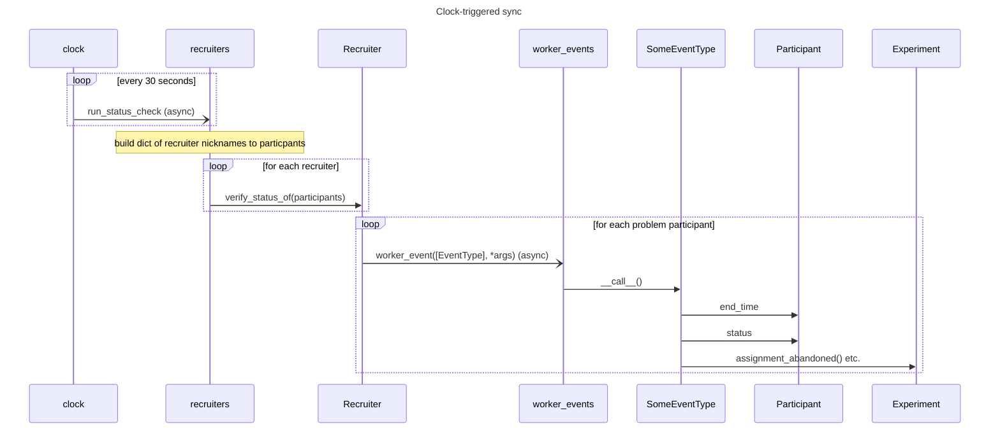
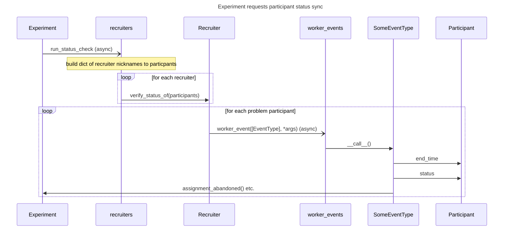

# Dallinger Participant Status Synchronization

Different recruitment systems offer different levels of support for receiving
status updates about participants.

Amazon MTurk is most helpful here, because the platform sends SNS notifications
about participants who return or abandon HITs **before** they recruit
replacements, so the experiment can update state (failing nodes of abandoned
participants and freeing network positions, for example) before new participants
arrive.

Prolific, on the other hand, sends replacement participants immediately with no
notifications (there is a currently a notification system in beta status). We
work around this by periodically polling the recruitment services for status
updates when necessary.

This polling takes two forms. In the first case, we poll every N (currently 30)
seconds based on a clock task:

In the second case, we allow the experiment to trigger a poll whenever a new
participant is assigned to a node, or according to some other rule of the
experimentor's choosing:

