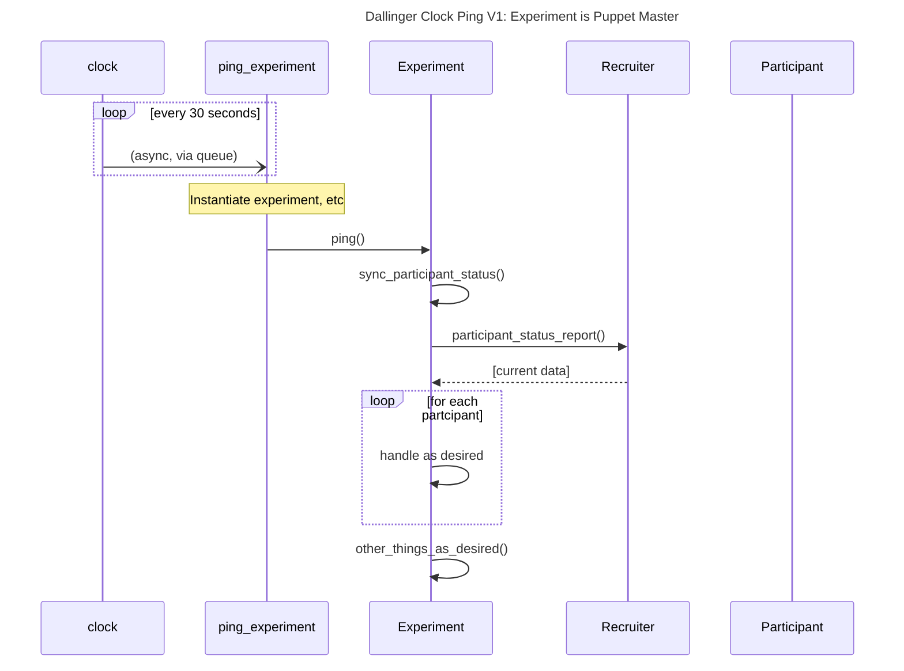

# Dallinger Participant Status Synchronization, v1

Version 1, where the experiment owns a lot of responsibility

```mermaid
sequenceDiagram
title Dallinger Clock Ping V1: Experiment is Puppet Master

participant c as clock
participant ping as ping_experiment
participant ex as Experiment
participant rec as Recruiter
%% participant platform as Recruitment Platform
participant part as Participant

loop every 30 seconds
    c-)ping: (async, via queue)
end

Note over ping: Instantiate experiment, etc

ping->>ex: ping()
ex->>ex: sync_participant_status()
ex->>rec: participant_status_report()
rec-->>ex: [current data]
loop for each partcipant
    ex->>ex: handle as desired
end

ex->>ex: other_things_as_desired()
```