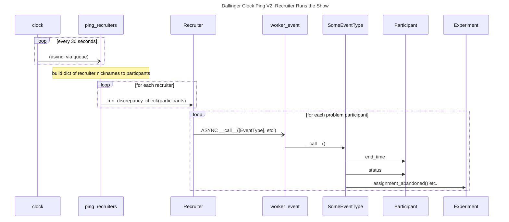

# Dallinger Participant Status Synchronization, v2

Version 2, where the recruiter and dallinger framework own more responsibility

```mermaid
sequenceDiagram
title Dallinger Clock Ping V2: Recruiter Runs the Show

participant c as clock
participant ping as ping_recruiters
participant rec as Recruiter
participant w as worker_event
participant evt as SomeEventType
participant part as Participant
participant ex as Experiment

loop every 30 seconds
    c-)ping: (async, via queue)
end

Note over ping: build dict of recruiter nicknames to particpants
loop for each recruiter
    ping->>rec: run_discrepancy_check(participants)
end

loop for each problem participant
    rec-)w: ASYNC __call__([EventType], etc.)
    w->>evt: __call__()
    evt->>part: end_time
    evt->>part: status
    evt->>ex: assignment_abandoned() etc.
end
```