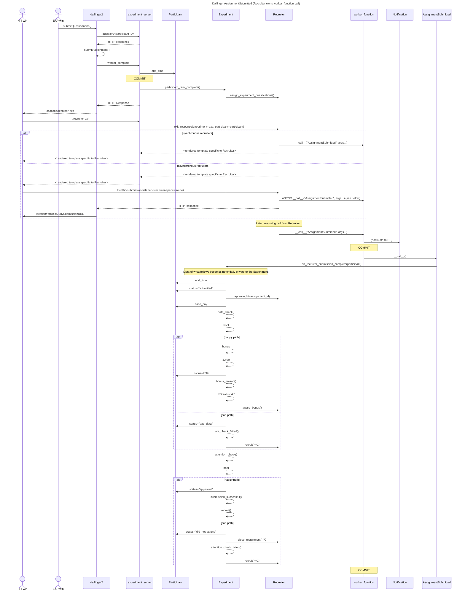

# Dallinger Task Submission and Completion

A mermaid syntax diagram of task completion and subsequent triggered execution paths.

```mermaid
sequenceDiagram
title Dallinger AssignmentSubmitted (Recruiter owns worker_function call)

actor hw as HIT win
actor ew as EXP win
participant d2 as dallinger2
participant es as experiment_server
participant part as Participant

participant ex as Experiment
participant rec as Recruiter
participant wf as worker_function
participant nt as Notification
participant sub as AssignmentSubmitted


ew->>d2: submitQuestionnaire()
d2->>es: /question/<participant ID>
es-->>d2: HTTP Response
d2->>d2: submitAssignment()
d2->>es: /worker_complete
es->>part: end_time
note over es: COMMIT
es->>ex: participant_task_complete()
ex->>rec: assign_experiment_qualifications()

es-->>d2: HTTP Response
d2-->>hw: location=/recruiter-exit
hw->>es: /recruiter-exit
es->>rec: exit_response(experiment=exp, participant=participant)
alt synchronous recruiters
rec->>wf: __call__("AssignmentSubmitted", args...)
rec-->>es: <rendered template specific to Recruiter>
es-->>hw: <rendered template specific to Recruiter>
else asynchronous recruiters
rec-->>es: <rendered template specific to Recruiter>
es-->>hw: <rendered template specific to Recruiter>
hw->>rec: /prolific-submission-listener (Recruiter-specific route)
rec->>wf: ASYNC __call__("AssignmentSubmitted", args...) (see below)

rec-->>d2: HTTP Response
d2->>hw: location=prolificStudySubmissionURL
end

note over rec: Later, resuming call from Recruiter...
rec->>wf: __call__("AssignmentSubmitted", args...)
wf->>nt: (add Note to DB)
note over wf: COMMIT
wf->>sub: __call__()
sub->>ex: on_recruiter_submission_complete(participant)
note over ex: Most of what follows becomes potentially private to the Experiment:
ex->>part: end_time
ex->>part: status="submitted"

ex->>rec: approve_hit(assignment_id)
ex->>part: base_pay


ex->>ex: data_check()
ex-->>ex: bool
alt happy path
ex->>ex: bonus
ex-->>ex: $2.99
ex->>part: bonus=2.99
ex->>ex: bonus_reason()
ex-->>ex: \"Great work"
ex->>rec: award_bonus()
else sad path
ex->>part: status="bad_data"
ex->>ex: data_check_failed()
ex->>rec: recruit(n=1)
end


ex->>ex: attention_check()
ex-->>ex: bool
alt happy path
ex->>part: status="approved"
ex->>ex: submission_successful()
ex->>ex: recruit()

else sad path
ex->>part: status="did_not_attend"
ex->>rec: close_recruitment() ??
ex->>ex: attention_check_failed()
ex->>rec: recruit(n=1)
end
note over wf: COMMIT
```