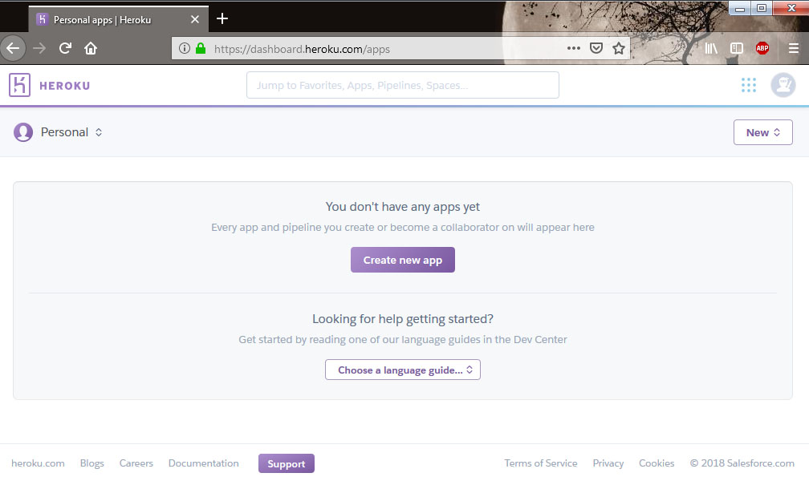

Setting Up AWS, Mechanical Turk, and Heroku
===========================================

Before you can use Dallinger, you will need accounts with Amazon Web
Services, Amazon Mechanical Turk, and Heroku. You will then need to
create a configuration file and set up your environment so that
Dallinger can access your accounts.

Create the configuration file
-----------------------------

The first step is to create the Dallinger configuration file in your home
directory. You can do this using the Dallinger command-line utility
through

::

    dallinger setup

which will prepopulate a hidden file ``.dallingerconfig`` in your home
directory. Alternatively, you can create this file yourself and fill it
in like so:

::

    [AWS Access]
    aws_access_key_id = ???
    aws_secret_access_key = ???
    aws_region = us-east-1

In the next steps, we'll fill in your config file with keys.

Note: The ``.dallingerconfig`` can be configured with many different parameters, see
:doc:`Configuration <configuration>` for detailed explanation of each configuration option.

Amazon Web Services API Keys
----------------------------

There are two ways to get API keys for Amazon Web Services. If you are the only
user in your AWS account, the simplest thing to do is generate root user access
keys, by `following these instructions
<https://docs.aws.amazon.com/general/latest/gr/managing-aws-access-keys.html>`__.
You might be presented a dialog box with options to continue to security
credentials, or get started with IAM users. If you are the only user, or you
are otherwise certain that this is what you want to do (see the following note),
choose "Continue to Security Credentials".

**N.B.** One feature of AWS API keys is that they are only displayed
once, and though they can be regenerated, doing so will render invalid
previously generated keys. If you are running experiments using a
laboratory account (or any other kind of group-owned account),
regenerating keys will stop other users who have previously generated
keys from being able to use the AWS account. Unless you are sure that
you will not be interrupting others' workflows, it is advised that you
do **not** generate new API keys. If you are not the primary user of the
account, see if you can obtain these keys from others who have
successfully used AWS.

If you are not the primary user of your AWS account, or are part of a working
group that shares the account, the recommended way to create the access keys is
by creating IAM users and generating keys for them. If someone else manages
the AWS account, ask them to generate the user and keys for you. If you need
to manage the users and keys by yourself, `follow these instructions
<https://docs.aws.amazon.com/IAM/latest/UserGuide/id_users_create.html>`__.

If you are using an IAM user instead of an AWS root account, then you will
need to ensure the IAM user is granted the following permissions::

    AmazonS3FullAccess
    AmazonMechanicalTurkFullAccess
    AmazonSNSFullAccess

You may want to assign these permissions by creating a Dallinger Group in
the IAM console and assigning users to it.

.. figure:: _static/Dallinger\ AWS\ Group.png
   :alt: Dallinger IAM Group

   Example Dallinger IAM Group

After you have generated and saved your AWS access keys, fill in the following
lines of ``.dallingerconfig``, replacing ``???`` with your keys:

::

    [AWS Access]
    aws_access_key_id = ???
    aws_secret_access_key = ???

Amazon Mechanical Turk
----------------------

It's worth signing up for Amazon Mechanical Turk (perhaps using your AWS
account from above), both as a
`requester <https://requester.mturk.com/mturk/beginsignin>`__ and as a
`worker <https://www.mturk.com/mturk/beginsignin>`__. You'll use this to
test and monitor experiments. You should also sign in to each sandbox,
`requester <https://requester.mturk.com/begin_signin>`__ and
`worker <https://workersandbox.mturk.com/mturk/welcome>`__ using the
same account. Store this account and password somewhere, but you don't
need to tell it to Dallinger.

Heroku
------

Next, sign up for a `Heroku <https://www.heroku.com/>`__ account.

You should see an interface that looks something like the following:

   This is the interface with the Heroku app

Then, log in from the command line:

::

    heroku login

Open Science Framework (optional)
---------------------------------

There is an optional integration that uses the `Open Science Framework
<https://osf.io/>`__ (OSF) to register experiments. First, create an account
on the OSF. Next create a new OSF personal access token on the `OSF settings
page <https://osf.io/settings/tokens/>`__. Since experiment registration
requires writing to the OSF account, be sure to grant the full write scope
when creating the token, by checking the osf.full_write box before creation.

Finally, fill in the appropriate section of ``.dallingerconfig``:

::

    [OSF]
    osf_access_token = ???

Done?
-----

Done. You're now all set up with the tools you need to work with
Dallinger.

Next, we'll :doc:`test Dallinger to make sure it's working on your
system <demoing_dallinger>`.
