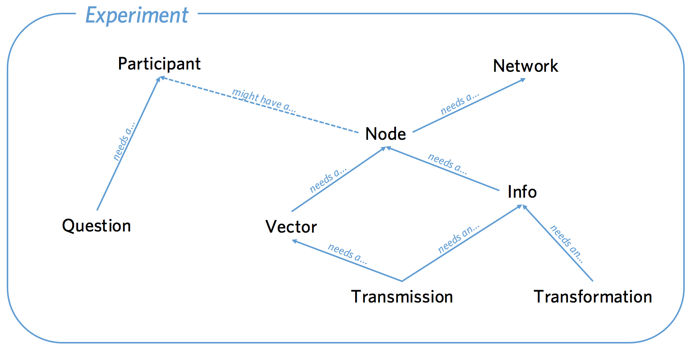

Database API
============

.. _classes:

The classes involved in a Dallinger experiment are:
:class:`~dallinger.models.Network`, :class:`~dallinger.models.Node`,
:class:`~dallinger.models.Vector`, :class:`~dallinger.models.Info`,
:class:`~dallinger.models.Transmission`,
:class:`~dallinger.models.Transformation`,
:class:`~dallinger.models.Participant`, and
:class:`~dallinger.models.Question`. The code for all these classes can
be seen in ``models.py``. Each class has a corresponding table in the
database, with each instance stored as a row in the table. Accordingly,
each class is defined, in part, by the columns that constitute the table
it is stored in. In addition, the classes have relationships to other
objects and a number of functions.

The classes have relationships to each other as shown in the diagram
below. Be careful to note which way the arrows point. A :class:`~dallinger.models.Node` is a
point in a :class:`~dallinger.models.Network` that might be associated with a :class:`~dallinger.models.Participant`.
A :class:`~dallinger.models.Vector` is a directional connection between a :class:`~dallinger.models.Node` and another
:class:`~dallinger.models.Node`. An :class:`~dallinger.models.Info` is information created by a :class:`~dallinger.models.Node`. A
:class:`~dallinger.models.Transmission` is an instance of an :class:`~dallinger.models.Info` being sent along a
:class:`~dallinger.models.Vector`. A :class:`~dallinger.models.Transformation` is a relationship between an :class:`~dallinger.models.Info`
and another :class:`~dallinger.models.Info`. A :class:`~dallinger.models.Question` is a survey response created by a
:class:`~dallinger.models.Participant`.

SharedMixin
-----------

All Dallinger classes inherit from a ``SharedMixin`` which provides multiple
columns that are common across tables:

.. autoattribute:: dallinger.models.SharedMixin.id
    :annotation:

.. autoattribute:: dallinger.models.SharedMixin.creation_time
    :annotation:

.. autoattribute:: dallinger.models.SharedMixin.property1
    :annotation:

.. autoattribute:: dallinger.models.SharedMixin.property2
    :annotation:

.. autoattribute:: dallinger.models.SharedMixin.property3
    :annotation:

.. autoattribute:: dallinger.models.SharedMixin.property4
    :annotation:

.. autoattribute:: dallinger.models.SharedMixin.property5
    :annotation:

.. autoattribute:: dallinger.models.SharedMixin.failed
    :annotation:

.. autoattribute:: dallinger.models.SharedMixin.time_of_death
    :annotation:

Network
-------

The :class:`~dallinger.models.Network` object can be imagined as a set of other objects with
some functions that perform operations over those objects. The objects
that :class:`~dallinger.models.Network`'s have direct access to are all the :class:`~dallinger.models.Node`'s in the
network, the :class:`~dallinger.models.Vector`'s between those Nodes, Infos created by those
Nodes, Transmissions sent along the Vectors by those Nodes and
Transformations of those Infos. Participants and Questions do not exist
within Networks. An experiment may involve multiple Networks,
Transmissions can only occur within networks, not between them.

.. autoclass:: dallinger.models.Network

Columns
~~~~~~~

.. autoattribute:: dallinger.models.Network.type
    :annotation:

.. autoattribute:: dallinger.models.Network.max_size
    :annotation:

.. autoattribute:: dallinger.models.Network.full
    :annotation:

.. autoattribute:: dallinger.models.Network.role
    :annotation:

Relationships
~~~~~~~~~~~~~

.. attribute:: dallinger.models.Network.all_nodes

    All the Nodes in the network.

.. attribute:: dallinger.models.Network.all_vectors

    All the vectors in the network.

.. attribute:: dallinger.models.Network.all_infos

    All the infos in the network.

.. attribute:: dallinger.models.Network.networks_transmissions

    All the transmissions int he network.

.. attribute:: dallinger.models.Network.networks_transformations

    All the transformations in the network.

Methods
~~~~~~~

.. automethod:: dallinger.models.Network.__repr__

.. automethod:: dallinger.models.Network.__json__

.. automethod:: dallinger.models.Network.calculate_full

.. automethod:: dallinger.models.Network.fail

.. automethod:: dallinger.models.Network.infos

.. automethod:: dallinger.models.Network.latest_transmission_recipient

.. automethod:: dallinger.models.Network.nodes

.. automethod:: dallinger.models.Network.print_verbose

.. automethod:: dallinger.models.Network.size

.. automethod:: dallinger.models.Network.transformations

.. automethod:: dallinger.models.Network.transmissions

.. automethod:: dallinger.models.Network.vectors

Node
----

Each Node represents a single point in a single network. A Node must be
within a Network and may also be associated with a Participant.

.. autoclass:: dallinger.models.Node

Columns
~~~~~~~

.. autoattribute:: dallinger.models.Node.type
    :annotation:

.. autoattribute:: dallinger.models.Node.network_id
    :annotation:

.. autoattribute:: dallinger.models.Node.participant_id
    :annotation:

Relationships
~~~~~~~~~~~~~

.. autoattribute:: dallinger.models.Node.network
    :annotation:

.. autoattribute:: dallinger.models.Node.participant
    :annotation:

.. attribute:: dallinger.models.Node.all_outgoing_vectors

    All the vectors going out from this Node.

.. attribute:: dallinger.models.Node.all_incoming_vectors

    All the vectors coming in to this Node.

.. attribute:: dallinger.models.Node.all_infos

    All Infos created by this Node.

.. attribute:: dallinger.models.Node.all_outgoing_transmissions

    All Transmissions sent from this Node.

.. attribute:: dallinger.models.Node.all_incoming_transmissions

    All Transmissions sent to this Node.

.. attribute:: dallinger.models.Node.transformations_here

    All transformations that took place at this Node.

Methods
~~~~~~~

.. automethod:: dallinger.models.Node.__repr__

.. automethod:: dallinger.models.Node.__json__

.. automethod:: dallinger.models.Node._to_whom

.. automethod:: dallinger.models.Node._what

.. automethod:: dallinger.models.Node.connect

.. automethod:: dallinger.models.Node.fail

.. automethod:: dallinger.models.Node.is_connected

.. automethod:: dallinger.models.Node.infos

.. automethod:: dallinger.models.Node.mutate

.. automethod:: dallinger.models.Node.neighbors

.. automethod:: dallinger.models.Node.receive

.. automethod:: dallinger.models.Node.received_infos

.. automethod:: dallinger.models.Node.replicate

.. automethod:: dallinger.models.Node.transformations

.. automethod:: dallinger.models.Node.transmissions

.. automethod:: dallinger.models.Node.transmit

.. automethod:: dallinger.models.Node.update

.. automethod:: dallinger.models.Node.vectors

Vector
------

A vector is a directional link between two nodes. Nodes connected by a
vector can send Transmissions to each other, but because Vectors have a
direction, two Vectors are needed for bi-directional Transmissions.

.. autoclass:: dallinger.models.Vector

Columns
~~~~~~~

.. autoattribute:: dallinger.models.Vector.origin_id
    :annotation:

.. autoattribute:: dallinger.models.Vector.destination_id
    :annotation:

.. autoattribute:: dallinger.models.Vector.network_id
    :annotation:

Relationships
~~~~~~~~~~~~~

.. autoattribute:: dallinger.models.Vector.origin
    :annotation:

.. autoattribute:: dallinger.models.Vector.destination
    :annotation:

.. autoattribute:: dallinger.models.Vector.network
    :annotation:

.. attribute:: dallinger.models.Vector.all_transmissions

    All Transmissions sent along the Vector.

Methods
~~~~~~~

.. automethod:: dallinger.models.Vector.__repr__

.. automethod:: dallinger.models.Vector.__json__

.. automethod:: dallinger.models.Vector.fail

.. automethod:: dallinger.models.Vector.transmissions

Info
----

An Info is a piece of information created by a Node. It can be sent
along Vectors as part of a Transmission.

.. autoclass:: dallinger.models.Info

Columns
~~~~~~~

.. autoattribute:: dallinger.models.Info.id
    :annotation:

.. autoattribute:: dallinger.models.Info.creation_time
    :annotation:

.. autoattribute:: dallinger.models.Info.property1
    :annotation:

.. autoattribute:: dallinger.models.Info.property2
    :annotation:

.. autoattribute:: dallinger.models.Info.property3
    :annotation:

.. autoattribute:: dallinger.models.Info.property4
    :annotation:

.. autoattribute:: dallinger.models.Info.property5
    :annotation:

.. autoattribute:: dallinger.models.Info.failed
    :annotation:

.. autoattribute:: dallinger.models.Info.time_of_death
    :annotation:

.. autoattribute:: dallinger.models.Info.type
    :annotation:

.. autoattribute:: dallinger.models.Info.origin_id
    :annotation:

.. autoattribute:: dallinger.models.Info.network_id
    :annotation:

.. autoattribute:: dallinger.models.Info.contents
    :annotation:

Relationships
~~~~~~~~~~~~~

.. autoattribute:: dallinger.models.Info.origin
    :annotation:

.. autoattribute:: dallinger.models.Info.network
    :annotation:

.. attribute:: dallinger.models.Info.all_transmissions

    All Transmissions of this Info.

.. attribute:: dallinger.models.Info.transformation_applied_to

    All Transformations of which this info is the ``info_in``

.. attribute:: dallinger.models.Info.transformation_whence

    All Transformations of which this info is the ``info_out``

Methods
~~~~~~~

.. automethod:: dallinger.models.Info.__repr__

.. automethod:: dallinger.models.Info.__json__

.. automethod:: dallinger.models.Info._mutated_contents

.. automethod:: dallinger.models.Info.fail

.. automethod:: dallinger.models.Info.transformations

.. automethod:: dallinger.models.Info.transmissions

Transmission
------------

A transmission represents an instance of an Info being sent along a
Vector. Transmissions are not necessarily received when they are sent
(like an email) and must also be received by the Node they are sent to.

.. autoclass:: dallinger.models.Transmission

Columns
~~~~~~~

.. autoattribute:: dallinger.models.Transmission.origin_id
    :annotation:

.. autoattribute:: dallinger.models.Transmission.destination_id
    :annotation:

.. autoattribute:: dallinger.models.Transmission.vector_id
    :annotation:

.. autoattribute:: dallinger.models.Transmission.network_id
    :annotation:

.. autoattribute:: dallinger.models.Transmission.info_id
    :annotation:

.. autoattribute:: dallinger.models.Transmission.receive_time
    :annotation:

.. autoattribute:: dallinger.models.Transmission.status
    :annotation:

Relationships
~~~~~~~~~~~~~

.. autoattribute:: dallinger.models.Transmission.origin
    :annotation:

.. autoattribute:: dallinger.models.Transmission.destination
    :annotation:

.. autoattribute:: dallinger.models.Transmission.vector
    :annotation:

.. autoattribute:: dallinger.models.Transmission.network
    :annotation:

.. autoattribute:: dallinger.models.Transmission.info
    :annotation:

Methods
~~~~~~~

.. automethod:: dallinger.models.Transmission.__repr__

.. automethod:: dallinger.models.Transmission.__json__

.. automethod:: dallinger.models.Transmission.fail

.. automethod:: dallinger.models.Transmission.mark_received

Transformation
--------------

A Transformation is a relationship between two Infos. It is similar to
how a Vector indicates a relationship between two Nodes, but whereas a
Vector allows Nodes to Transmit to each other, Transformations don't
allow Infos to do anything new. Instead they are a form of book-keeping
allowing you to keep track of relationships between various Infos.

.. autoclass:: dallinger.models.Transformation

Columns
~~~~~~~

.. autoattribute:: dallinger.models.Transformation.type
    :annotation:

.. autoattribute:: dallinger.models.Transformation.node_id
    :annotation:

.. autoattribute:: dallinger.models.Transformation.network_id
    :annotation:

.. autoattribute:: dallinger.models.Transformation.info_in_id
    :annotation:

.. autoattribute:: dallinger.models.Transformation.info_out_id
    :annotation:

Relationships
~~~~~~~~~~~~~

.. autoattribute:: dallinger.models.Transformation.node
    :annotation:

.. autoattribute:: dallinger.models.Transformation.network
    :annotation:

.. autoattribute:: dallinger.models.Transformation.info_in
    :annotation:

.. autoattribute:: dallinger.models.Transformation.info_out
    :annotation:

Methods
~~~~~~~

.. automethod:: dallinger.models.Transformation.__repr__

.. automethod:: dallinger.models.Transformation.__json__

.. automethod:: dallinger.models.Transformation.fail

Participant
-----------

The Participant object corresponds to a real world participant. Each
person who takes part will have a corresponding entry in the Participant
table. Participants can be associated with Nodes and Questions.

.. autoclass:: dallinger.models.Participant

Columns
~~~~~~~

.. autoattribute:: dallinger.models.Participant.type
    :annotation:

.. autoattribute:: dallinger.models.Participant.worker_id
    :annotation:

.. autoattribute:: dallinger.models.Participant.assignment_id
    :annotation:

.. autoattribute:: dallinger.models.Participant.unique_id
    :annotation:

.. autoattribute:: dallinger.models.Participant.hit_id
    :annotation:

.. autoattribute:: dallinger.models.Participant.mode
    :annotation:

.. autoattribute:: dallinger.models.Participant.end_time
    :annotation:

.. autoattribute:: dallinger.models.Participant.base_pay
    :annotation:

.. autoattribute:: dallinger.models.Participant.bonus
    :annotation:

.. autoattribute:: dallinger.models.Participant.status
    :annotation:

Relationships
~~~~~~~~~~~~~

.. attribute:: dallinger.models.Participant.all_questions

    All the questions associated with this participant.

.. attribute:: dallinger.models.Participant.all_nodes

    All the Nodes associated with this participant.

Methods
~~~~~~~

.. automethod:: dallinger.models.Participant.__json__

.. automethod:: dallinger.models.Participant.fail

.. automethod:: dallinger.models.Participant.infos

.. automethod:: dallinger.models.Participant.nodes

.. automethod:: dallinger.models.Participant.questions

Question
--------

A Question is a way to store information associated with a Participant
as opposed to a Node (Infos are made by Nodes, not Participants).
Questions are generally useful for storing responses debriefing
questions etc.

.. autoclass:: dallinger.models.Question

Columns
~~~~~~~

.. autoattribute:: dallinger.models.Question.type
    :annotation:

.. autoattribute:: dallinger.models.Question.participant_id
    :annotation:

.. autoattribute:: dallinger.models.Question.number
    :annotation:

.. autoattribute:: dallinger.models.Question.question
    :annotation:

.. autoattribute:: dallinger.models.Question.response
    :annotation:

Relationships
~~~~~~~~~~~~~

.. autoattribute:: dallinger.models.Question.participant

Methods
~~~~~~~

.. automethod:: dallinger.models.Question.__json__

.. automethod:: dallinger.models.Question.fail

