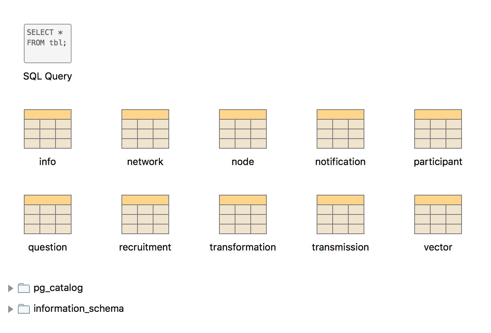

The Database
============

At the heart of Dallinger is the database. If you've already installed Dallinger (thumbs up) you might remember having to install something called "Postgres". That's a program that allows you to create databases on your own machine, and so is essential for running Dallinger locally (i.e. in "debug mode"). You might also have installed a program called "Postico". This is a database viewer, allowing you to open up the database and look inside.

Let's do this now. First, open up the terminal and navigate to the directory containing the Bartlett1932 demo (its address is Dallinger/demos/dlgr/demos/bartlett1932). Once you're there, execute the command ``dallinger debug`` and the experiment will run locally on your machine (remember you can use the command ``dallinger debug --verbose`` to see more information). After a few seconds of thinking, dallinger should pop open a new browser window inviting you to take part in the study. You can take part now, but instead, let's look at the database in Postico. Once you've opened the database you should see that it consists of a series of tables with names like `info` and `vector`.

You can double-click on these tables to view their contents. Right now almost all of them are empty, though a couple will have some entries in them. You don't need to understand what the entries (or lack therof) means right now. Simply note that from this point of view, the database looks just like a series of spreadsheets: there are columns with names, and entries are stored as rows in the table. Morevoer, there are different tables for different kinds of things: a table for `nodes`, a table for `vectors` and so on. In fact, there's a separate table for almost all of the key classes used in Dallinger. It is perfectly fine to think of the database in this way --- as a series of tables --- but this ignores some of its most powerful and useful features, so we'll briefly discuss the dual nature of the database now.

Table/Object Duality
--------------------

In quantum mechanics there is a phenomenon known as wave/particle duality. It basically means that various sub-atomic particles, depending on the conditions, can behave like either a particle or a wave. This was a big deal to physicists because for centuries it had been assumed that things could either be a particle or a wave, but not both. By the late 19th century people were pretty confident that things like electrons were particles, though there had been vigorous debate over whether light was a particle or a wave. In the end it turns out the answer is "both, sort of": depending how you observe them, light "photons" will behave like particles or like a wave, and the conclusion, therefore, is that they're actually something else that has properties of both particles and waves.

The point of this digression is to get you to think about how a single thing can have a dual nature. From glancing at the tables you can see that certain objects (like a `node`, for instance) can be stored as a row in a table. Because of this, anything you can do with a row of data you can do with nodes. For instance you can look them up by a particular value (not the most exciting stuff I admit). But when your experiment is running, this row of data in a table in the database will have properties that seem to go beyond what a simply row of data can do. In some contexts, entities like nodes
will also include `behavior`.

Let's illustrate this with an example. Imagine you want to know the creation time of the network that contains the node with id 5. This might sound a little daunting, but it you rootle around in Postico you'll see that the node table contains a column called `network_id` and the network table contains a column called `creation_time`. If we approach this problem thinking in terms of tables, here's a rough description of how we could solve it:

1. Do a query over the node table asking for all rows with an id of 5 (there will only be one)
2. Look at the `network_id` of the returned row; let's say it's 3
3. Do a query over the network table asking for all rows with an id of 3 (again, there will only be one)
4. Look at the `creation_time` of the returned row

This will work, but it's a little clunky. Once you get more comfortable with approaching rows in the tables as if they were smart objects, you can do something more like this:

1. Do a query over the node table asking for all rows with an id of 5 (there will only be one).
2. Ask the row/object/node/whatever for its network.
3. Ask the network for its creation time.

In fact, this can be even cleaner. Let's assume you've looked up the node with an id of 5 and you've stored it as a variable called ``node5``. To get the creation time of its network, you can simply write ``node5.network.creation_time`` and this will give you the exact time at which that object was created (i.e. the exact time that row was entered into the network table). Lovely!

Why do we have a database?
--------------------------

Given the above, where a problem can be solved quickly and elegantly by thinking in terms of objects, but slowly and clunkily by thinking in terms of rows in tables, you might ask why we have tables at all. Can't we just have a database of objects?

One reason for the database is that, at the end of your experiment, you'll somehow want to export all the data generated by your experiment for analysis and so on. The database is what gets exported. Basically, all the tables are converted into csv files, then dumped into a folderin inside your experiment directory. Obviously at this point the row/object duality is broken: you now really do just have a bunch of tables. This might not seem totally satisfactory though, after all, why not have the experiment use objects and just create the tables for when you need to export the data at the end?

Here's why this wouldn't work. Imagine you are running an experiment and 50 participants are taking part at the same time. They are all clicking away on their computers and this is sending various requests to the server to record their responses and advance the experiment, and so on. However, each request takes time, and even though each request might only require a few milliseconds there will come a point at which the server can't process the requests fast enough. This will lead to a growing backlog of requests and eventually the server will crash and you'll get a bunch of emails from annoyed participants. The solution is to parallelize the server - in effect we have multiple servers (called `threads`) which run in parallel to get through requests far faster than they come in. But this raises a problem; if there are now multiple threads how can we be sure that they agree on the current state of the experiment? Without something to hold them together they might drift apart and so our experiment will become a total mess. What we need is some `separate process` to store the "truth" of the experiment.

To solve this, let's make one more thread that doesn't handle requests, but rather stores in its memory all of the experiment as objects. Now, when the other threads are handling requests they check in with this thread to confirm the current state of the experiment. But now we are back to the same problem we started with: because all requests need to go through this "master" thread, we have a major bottleneck and in effect the experiment will be no faster than if it had a single thread. The solution is to replace the master thread with a set of tables and all the other threads to examine and edit the tables at the same time. In this way the database stores the "truth" as rows in a table and the server threads read from the database, turning the rows in the database into objects in their memory as necessary.

You might be worried that two threads might try to edit the same row at the same time (and this would indeed be a problem), but fortunately there's an easy solution: While a thread is reading/editing specific rows in the database, those rows can be `locked` and any other threads that want to read or edit them have to wait. Because locking can be done on a row-by-row basis, the rest of the database remains totally accessible (this locking is also done automatically so you don't need to worry about it). Moreover, because multiple threads only rarely try to access the same rows this causes only a tiny slow down in the rate at which the server can process.

So, even though it's nicer to think in terms of objects, we need a database with tables and rows because otherwise we are forced to have only a single server thread handling all incoming requests which is too slow for anything other than the smallest experiment.
