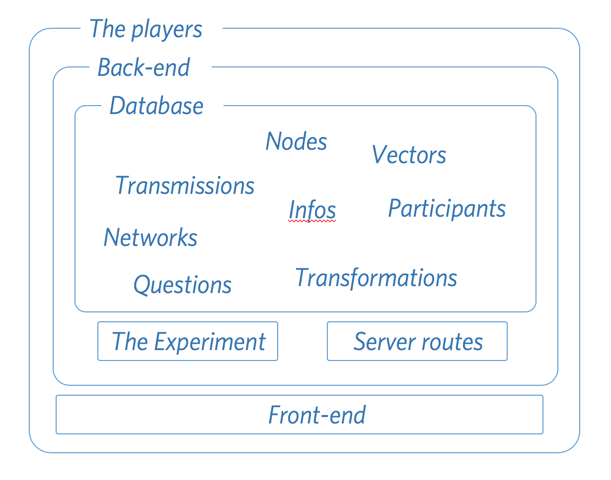

Introducing the Players
=======================

From the outside Dallinger might appear to be a single program, but under the surface it is actually composed of multiple different parts that work together to acheive the desired results. You can think of it as a ballet; once the show starts all the different parts perform choreographed series of movements, sometimes on their own, sometimes in concert with each other. Your role in this metaphor is that of choreographer: before the show is performed you write out exactly what moves you want each player to perform at what time. But who are the players? The diagram below gives a rough outline of the key components of Dallinger: (1) The database, containing nodes, vectors networks and so on, (2) The experiment, (3) The back-end routes, and (4) the front-end, composed of html, css and javascript.

The purpose of Part 2 of this book is to give you a detailed introduction to each of the components. Because actually running experiments involves each component interacting with all the others, at times you might feel unable to see how any of this could possibly lead to the execution of a full fledged experiment. But keep the faith! At the end of this part we will go through a series of demos showing, step-by-step, how these different parts combine when an experiment is executed. You might be tempted to skip ahead to that point now, but that's probably a bad idea as unless you already understand what the different parts are you will almost certainly fail to understand their interactions.