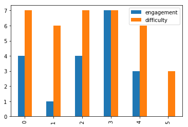

Experiment Data
===============

Dallinger keeps track of experiment data using the database. All generated
data about Dallinger constructs, like networks, nodes, and participants, is
tracked by the system. In addition, experiment specific data, such as
questions and infos, can be stored.

The `info` table is perhaps the most useful for experiment creators. It is
intended for saving data specific to an experiment. Whenever an important
event needs to be recorded for an experiment, an Info can be created:

::

    def record_event(self, node, contents, details):
        info = Info(origin=node, contents=contents, details=details)
        session.add(info)
        session.commit()

In the above example, we have a function to record an event that would be
part of a long experiment code. Each time something important happens in the
experiment, the function will be called. In this case, we take the related
node as the first parameter, then a string representation of the event, and
finally an optional details parameter, which can include a dictionary, or
other data structure with details.

Dallinger allows users to export experiment data for performing analysis with
the tools of their choice. Data from all experiment tables are exported in CSV
format, which makes it easy to use in a variety of tools.

To export the data, the Dallinger `export` command is used. The command
requires passing in the application id. Example:

::

    $ dallinger export --app 6ab5e918-44c0-f9bc-5d97-a5ddbbddb68a

This will connect to the database and export the data, which will be saved as
a zip file inside the `data` directory:

::
    
    $ ls data
    6ab5e918-44c0-f9bc-5d97-a5ddbbddb68a.zip

To use the exported data, it is recommended that you unzip the file inside a
working directory. This will create a new `data` directory, which will
contain the experiment's exported tables as CSV files:

::

    $ unzip 6ab5e918-44c0-f9bc-5d97-a5ddbbddb68a.zip
    Archive:  6ab5e918-44c0-f9bc-5d97-a5ddbbddb68a-data.zip
      inflating: experiment_id.md
      inflating: data/network.csv
      inflating: data/info.csv
      inflating: data/notification.csv
      inflating: data/question.csv
      inflating: data/transformation.csv
      inflating: data/vector.csv
      inflating: data/transmission.csv
      inflating: data/participant.csv
      inflating: data/node.csv

Once the data is uncompressed, you can analyze it using many different
applications. Excel, for example, will easily import the data, just by double
clicking on one of the files.

In Python, pandas are a popular way of manipulating data. The library is
required by Dallinger, so if you already have Dallinger running you can begin
using it right away:

::

    $ python
    >>> import pandas
    >>> df = pandas.read_csv('question.csv')

Pandas has a handy `read_csv` method, which will read a CSV file and convert
it to a DataFrame, which is a sort of spreadsheet-like structure used by
Pandas to work with data. Once the data is in a DataFrame, we can use all the
DataFrame features to work with the data:

::

    >>> df.info()
	<class 'pandas.core.frame.DataFrame'>
	RangeIndex: 6 entries, 0 to 5
	Data columns (total 14 columns):
	id                6 non-null int64
	creation_time     6 non-null datetime64[ns]
	property1         0 non-null object
	property2         0 non-null object
	property3         0 non-null object
	property4         0 non-null object
	property5         0 non-null object
	failed            6 non-null object
	time_of_death     0 non-null object
	type              6 non-null object
	participant_id    6 non-null int64
	number            6 non-null int64
	question          6 non-null object
	response          6 non-null object
	dtypes: datetime64[ns](1), int64(3), object(10)
	memory usage: 744.0+ bytes
	None
	>>> df.response.describe()
	count                                       6
	unique                                      5
	top       {"engagement":"7","difficulty":"4"}
	freq                                        2
	Name: response, dtype: object

In this case, let's say we want to analyze questionnaire responses at the end
of an experiment. We will only need the `response` column from the `question`
table. Also, since this column is stored as a string, but holds a dictionary
with the answers to the questions, we need to convert it into a suitable
format for analysis:

::

    >>> df = pandas.read_csv('question.csv', usecols=['response'],
                converters={'response': lambda x:eval(x).values()})
    >>> df
	  response
	0   [4, 7]
	1   [1, 6]
	2   [4, 7]
	3   [7, 7]
	4   [3, 6]
	5   [0, 3]
    >>> responses=pandas.DataFrame(df['response'].values.tolist(),
                columns=['engagement', 'difficulty'], dtype='int64')
    >>> responses
	  engagement difficulty
	0          4          7
	1          1          6
	2          4          7
	3          7          7
	4          3          6
	5          0          3

First we create a DataFrame using `read_csv` as before, but this time, we
specify which columns to use using the `usecols` parameter. To get the
numeric values for the responses, we use a converter to convert the string
back into a dictionary and extract the values.

At this point, we have both values in the response column. We really want to
have one column for each value, so we create a new dataframe, converting the
response values to a list and assigning each to a named column. We also make
sure the values are integers, with the `dtype` parameter. This makes them
plottable.

We can now make a simple bar chart of the responses using plot:

::

    >>> responses.plot(kind='bar')
    <matplotlib.axes._subplots.AxesSubplot at 0x7f7f0092dc90>

If you are running this in a `Jupyter notebook <https://jupyter.org/>`__, this
would be the result:

Of course these are very simple examples. Pandas are a powerful library, and
offer many analysis and visualization methods, but this should at least give
an idea of what can be achieved.

Dallinger also has a helper class that allows us to handle experiment data in
different formats. You can get the DataFrame using this, as well:

::

    $ python
    >>> from dallinger.data import Table
    >>> data = Table('info.csv')
    >>> df = data.df

It might seem like a roundabout way to get the DataFrame, but the table class
has the advantage that the data can easily be converted to many other
formats. All of these formats are accessed as properties of the Table
instance, like `data.df` above. Supported formats are:

    - csv. Comma-separated values.
    - dict. A python dictionary.
    - df. A pandas DataFrame.
    - html. An html table.
    - latex. A LaTex table.
    - list. A python list.
    - ods. An open document spreadsheet.
    - tsv. Tab separated values.
    - xls. Legacy Excel spreadsheet.
    - xlsx. Excel spreadsheet.
    - yaml. YAML format.

From the list above `dict`, `df`, and `list` can be used to handle the data
inside a python interpreter or program, and the rest are better suited for
display or analysis using other tools.
