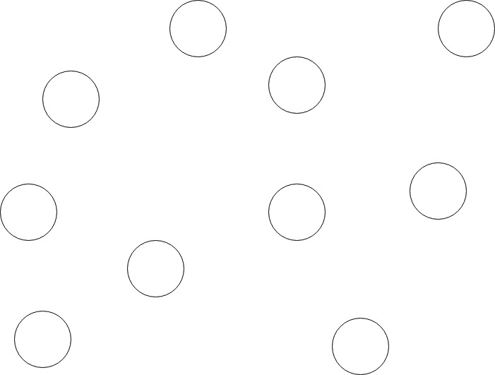
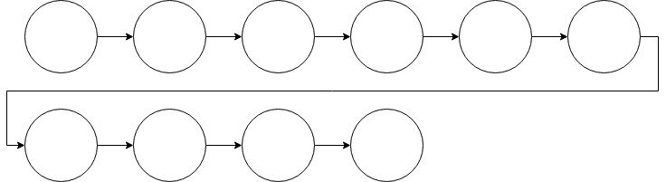
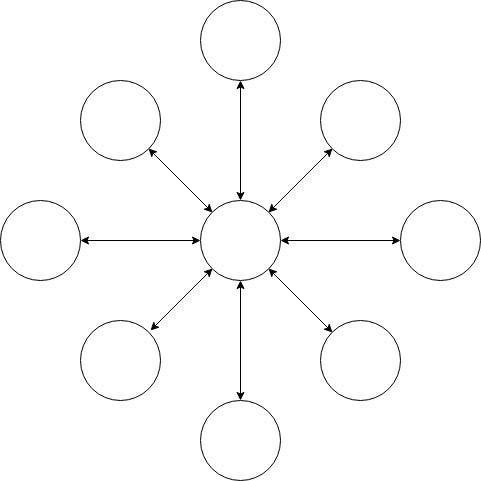
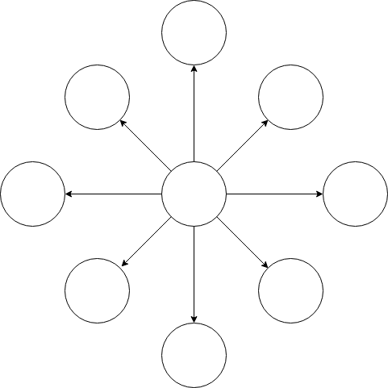
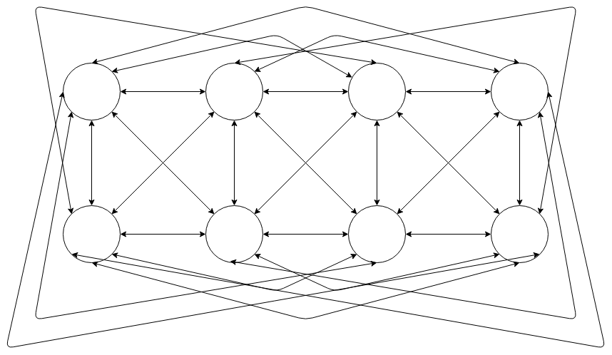

Networks
========

Depending on an experiment's objectives, there are different ways that
experiment participants can interact with each other and with the
experiment's stimuli. For some experiments, participants may receive the
same initial stimuli and process it individually. For other experiments,
they may sequentially interact with the stimuli. Some experiments may
require participants to interact among themselves in various ways.

In Dallinger, these interactions among participants and stimuli are
represented using networks. Each participant and each stimulus represent a
node in a network. The way these nodes are connected to each other is known
as a `network topology`. For brevity, we will use the term `network` from now
on when discussing Dallinger network topologies.

Dallinger comes with a variety of networks that can be used by experimenters,
and it's possible both to extend these networks or create completely new ones
as well. The networks included in Dallinger are:

- Empty
- Chain
- DelayedChain
- Star
- Burst
- FullyConnected
- DiscreteGenerational
- ScaleFree
- SequentialMicrosociety
- SplitSampleNetwork

Nodes and Sources
-----------------

In these networks, each participant is considered as a node. There is also a
special kind of node, known as a `source`, which transmits information to
other nodes. Sources are used in Dallinger as a means to send the stimuli to
the participants. Not all experiments have sources, though. A chatroom
experiment, for example, could just rely on user interactions and not
require any other stimuli.

All nodes have methods named ``transmit`` and ``receive``, for sending and
receiving information to or from other nodes. These methods can be used when
adding a node to allow any specialized communication between nodes that an
experiment may require.

Nodes can have a ``fitness`` property, which is a number that can be used in
some network models. The basic networks do not use this property.

Some networks require that nodes have other properties, so for properly using
those networks, an experiment would need to add these properties to its
nodes.

Node connections
----------------

A node can be connected to another node in three ways:

1. "to" - a single direction connection to another node
2. "from" - a single direction connection from another node
3. "both" - a bidirectional connection to another node

A node can transmit information when connected `to` another node. It can
receive information when connected `from` another node. If it is connected to
another node in `both` directions, it can both receive and transmit.

Nodes have a ``connect`` method that is used to connect them to other nodes.
This method can specify the direction of a connection:

::

    my_node.connect(some_node, direction='both')
    my_node.connect(another_node, direction='from')

The default direction is "to". The following example will make a `to`
connection:

::

    my_node.connect(another_node)
    
Note that sources can only transmit information, so the only connection type
allowed for a source node is `to` another node:

::

    my_source.connect(receiver_node)

Using a network
---------------

To use a specific network, an experiment needs to define a ``create_network``
method in its code. For example, to use a ``Chain`` network:

::

    from dallinger.experiment import Experiment
    from dallinger.networks import Chain

    class MyExperiment(Experiment):

        def create_network(self):
            return Chain(max_size=5)

Like the example shows, to use a network it's necessary to import it from
``dallinger.networks`` using the network class name (the name from the list
given above). Once imported, it needs to be initialized as part of the
experiment, which is done using the ``create_network`` method.

All networks accept the ``max_size`` parameter, which is illustrated above. It
represents the maximum number of nodes that a network can have. In the
example above, maximum size is 5 nodes. The ``full`` method of the network can
be used to check if a network is full.

Multiple networks
^^^^^^^^^^^^^^^^^

In experiments configured for a number of ``practice_repeats`` or
``experiment_repeats`` higher than one, the ``create_network`` method is called
multiple times, once for every repeat. This means that an experiment can have
multiple networks at the same time.

The experiment setup code assigns each network a role of `practice` or
`experiment`, depending on how it was created. The experiment class allows
experiment developers to query networks by role (practice, experiment), or by
state (full, not full). For example:

::

    all_networks = exp.networks()
    full_networks = exp.networks(full=True)
    not_full_networks = exp.networks(full=False)
    practice_networks = exp.networks(role='practice')
    full_experiment_networks = exp.networks(role='experiment', full=True)

Generally, the networks created at experiment setup will all be of the same
type, but there's nothing to stop an imaginative experimenter from creating a
different network type based on some condition, thus having multiple networks
of different types.

Common networks in Dallinger
----------------------------

Many experiments will be able to just use one of Dallinger's existing
networks, rather than defining their own. Lets look at the basic networks
that can be used out of the box.

Empty
^^^^^

There are experiments where participants do not need to interact with each
other at all. Generally, in this case, a source will be required. The Empty
network does not connect any nodes with each other, which results in a
series of isolated nodes. The only exception is, if a source node is added,
it will be connected to all existing nodes, which means that it's possible to
send a stimulus to all network nodes, regardless of their isolation.

   Empty Network

Chain
^^^^^

A Chain network, also known as `line` network, connects each new node to the
previous one, so that nodes can receive information from their parent, but
cannot send information back. In other words, it's a one way transmission
chain. In general, it's useful to have a source as the first node, so that
an initial experiment stimulus is transmitted to the each node through the
chain. Note that this network explicitly prohibits a source to be added after
any node, so the source has to come first.

This network can be useful for experiments where some piece of information,
for example, a text, needs to be modified or interpreted by each participant
in succession.

   Chain Network

DelayedChain
^^^^^^^^^^^^

DelayedChain is a special Chain network designed to work within the limits of
MTurk configuration, which sometimes requires at least 10 participants from
the start. In this case, for a Chain network, it would be impractical to make
participants sign on from the beginning and then wait for their turn  in the
Chain for a long time. To avoid this, DelayedChain basically ignores the
first 9 participants, and then starts the Chain from the 10th participant on.

This is intended to be used with a source, in order to form a long running
chain where participants are recruited as soon as the previous participant
has finished. If there's no source, the first eleven nodes have no parent.

.. figure:: _static/delayed.png
   :scale: 50 %
   :alt: DelayedChain Network

   DelayedChain Network

Star
^^^^

A Star network uses its first node as a central node, and nodes created
after that have a bidirectional connection (`both`) with that node. This
means the central node can send and receive information from/to all nodes,
but every other node in the network can only communicate with the central
node.

A source can't be used as a first node, since the connections to it need to
be in both directions.

This network can be useful for experiments where one user has a supervisory
role over others who are working individually, for example making a decision
based on advice from the other players

   Star Network

Burst
^^^^^

A Burst network is very similar to a Star network, except the central node is
connected to the other nodes using a `to` connection. In this case, a source
can be used as a central node.

This type of network can be used for experiments where participants do not
need to interact, but require the same stimuli or directions as the others.

   Burst Network

FullyConnected
^^^^^^^^^^^^^^

A FullyConnected network is one where all the nodes are connected to each
other in both directions, thus allowing any node to transmit and receive from
any other node. This can be very useful for cooperation experiments or
chatrooms.

A source is allowed as a node in this network. However, it will use a `to`
connection to the other nodes, so transmitting to it will not be allowed.

   FullyConnected Network

Other available networks
------------------------

There are other, somewhat more specialized networks that an experiment can
use. Here's a quick rundown.

DiscreteGenerational
^^^^^^^^^^^^^^^^^^^^

In this network, nodes are arranged into "generations". This network accepts
some new parameters: ``generations`` (number of generations), ``generation_size``
(how many nodes in a generation) and ``initial_source``. If there is an initial
source, it will be used as the parent for all first generation nodes. After
the first generation, the parent from each new node will be selected from the
previous generation, using the ``fitness`` attribute of the nodes to select it.
The higher the fitness, the higher the probability that a node will be a
parent.

Note that for this network to function correctly, the experiment nodes need
to have a ``generation`` property defined.

ScaleFree
^^^^^^^^^

This network takes two parameters: ``m0`` and ``m``. The first (m0) is the
number of initial nodes. These initial nodes will be connected in a fully
connected network among each other. The second parameter (m) is the number of
connections that every subsequent node will have. The nodes for this limited
number of connections will be chosen randomly, but nodes with more
connections will have a higher probability of being selected.

SequentialMicrosociety
^^^^^^^^^^^^^^^^^^^^^^

A network in which each new node will be connected using a `to` connection to
a limited set of its most recent predecessors. The number of recent
predecessors is passed in as an argument (n) at network creation.

SplitSampleNetwork
^^^^^^^^^^^^^^^^^^

This network helps when implementing split sample experiment designs. It
assigns a random boolean value to a property named ``exploratory``. When this
property is True, it means that the current network is part of the
exploratory data subset.

Creating a network
------------------

In addition to the available networks, it's fairly simple to create a custom
network, in case an experiment design calls for different node
interconnections. To create one, we can subclass from the Network model:

::

    from dallinger.models import Network
    from dallinger.nodes import Source

    class Ring(Network):

        __mapper_args__ = {"polymorphic_identity": "ring"}

        def add_node(self, node):
            other_nodes = [n for n in self.nodes() if n.id != node.id]

            if isinstance(node, Source):
                raise Exception(
                    "Ring network cannot contain sources."
                )

            if other_nodes:
                parent = max(other_nodes, key=attrgetter('creation_time'))
                parent.connect(whom=node)

                if len(self.nodes) == self.max_size:
                    parent = min(other_nodes, key=attrgetter('creation_time'))
                    node.connect(whom=parent)
                   
In the above example, we create a simple ring network, where each node is
connected in chain to the next one, until we get to the last one, which is
connected back to the first, making a full circle (thus, the 'ring' name).

Our ``Ring`` network is a subclass of ``dallinger.models.Network``, which contains the basic
network model and implementation. The ``__mapper_args__`` assignment at the
top is for differentiating this network from others, so that data exports
don't give incorrect results. Usually the safe thing is to use the same name
as the subclass, to avoid confusion.

Most simple networks will only need to override the ``add_node`` method. This
method is called after a node is added, with the added node as a parameter.
This method then can decide how and when to connect this node to other nodes
in the network.

In our code, we first get all nodes in the network (except the new one). If
the new node is a source, we raise an exception, because due to the circular
nature of our network, there can be no sources (they don't accept `from`
connections and can only transmit).

After that, we take the most recent node and connect it to the new node. At
this point, this is almost the same as a chain network, but when we get to
the last node, we connect the new node to the first node, in addition to its
connection to the previous node.

The code in the ``add_node`` method can be as complex as needed, so very
complex networks are possible. In most cases, to create a more advanced
network it will be necessary to add custom properties to it. This is done by
overriding the ``__init__`` method of the network to add the properties. The
following example shows how to do that:

::

    def __init__(self, new_property1, new_property2):
        self.property1 = repr(new_property1)
        self.property2 = repr(new_property2)

The properties are added as parameters to the network on creation. A custom
property need not be persistent, but in general it's better to save it as
part of the network using the persistent custom properties available in all
Dallinger models. If they are not stored, any calculations that rely on them
have to be performed at initialization time. Once they are stored, they can
be used in any part of the network code, like in the ``add_node`` method.

In the code above, we use ``repr`` when storing the property value. This is
because Dallinger custom properties are all of the text type, so even if a
custom property represents a number, it has to be stored as a string. If the
property is a string to begin with, it's not necessary to convert it.
