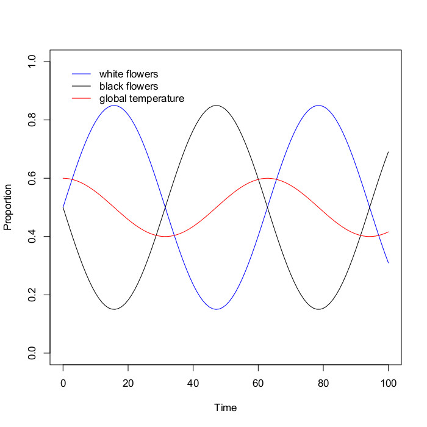

# Wright/Fisher Daisy World

The Wright/Fisher process is a common way to implement reproduction in evolutionary simulations. In this process reproduction occurs at a specific time and involves the entire replacement of the population with a new population of offspring. It can be contrasted with the Moran process, which is another common way to implement reproduction, but does not require reproduction to result in a total replacement of the population. In this demo, it is illustrated in the context of modified version of the well known "[daisyworld](http://en.wikipedia.org/wiki/Daisyworld)" simulation. This simulation imagines a planet where only two lifeforms exist: black flowers and white flowers. The black flowers absorb heat from a nearby star and cause the planet to warm, the white flower reflect heat and cause the planet to cool. In addition, the flowers fitness hinges on the temperature of the planet: black flowers do better on a cool planet, white flowers do better on a hot planet. As such, each flower type creates the conditions that favor the other and so the population typically ends up oscillating between the two types of flower as shown in the figure below:



The Wright/Fisher process follows this procedure:

1. Assign each agent a fitness - in the context of daisyworld this would take into account current temperature and color, but it could simply be a randomly generated number.
2. Normalize these fitnesses (i.e., divide them by the sum of all fitnesses)
3. For each offspring to be generated
  1. Randomly select an agent to be its parent, with sampling weighted by agents' normalized fitness
  2. Inherit from that agent, with mutation if desired
4. The offspring generation now replaces the parental generation

The Wright/Fisher process normally holds the population size constant (i.e., the number of offspring = number of agents in previous generation), however, population changes can easily be accommodated (e.g., have 50 agents generate 100 offspring). The code in the demo is written to be easy to follow, however, here is some code in the R language that shows an optimized version of the Wright/Fisher process:

```
fitness <- % some function to generate fitnesses of agents
fitness_normalized <- fitness/sum(fitness)

dummy <- runif(N,0,1)
fitness_dummy <- cumsum(fitness_normalized)
parents <- rep(0,N)
for (offspring in 1:N) {
	parents[offspring] <- match(TRUE,dummy[offspring]<fitness_dummy)
}
gene_offspring <- rnorm(N,gene[parents],mutation_parameter)
gene <- gene_offspring
```
Some examples of the Wright/Fisher process in the literature:

* Kandler, A., & Shennan, S. J. (2013). A non-equilibrium neutral model for analysing cultural change. Journal of Theoretical Biology, 330, 18–25. doi:10.1016/j.jtbi.2013.03.006
* Ram, Y., & Hadany, L. (2014). Stress-induced mutagenesis and complex adaptation. Proceedings of the Royal Society B: Biological Sciences, 281.

The original daisyworld paper:

* Watson, A.J.; J.E. Lovelock (1983). "Biological homeostasis of the global environment: the parable of Daisyworld". Tellus B (International Meteorological Institute) 35 (4): 286–9.
